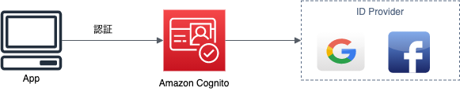

# CognitoによるGoogle認証の実装

Cognitoのユーザープールの機能を利用して、OAuthによるGoogle認証の機能を作成します。

今回すること

- GCPでGoogleのOAuthに必要なリソースの作成(手動)
    - Terraformで利用できるようなAPIがないようであるため
- TerraformでCognitoユーザープールのリソースを作成
- ホストされたUIでGoogleログインができることを確認

今回しないこと

- クライアントアプリで独自UIを作成して、Google認証を実装
- CognitoのIDプールを活用して、AWSリソースへの認可
  - 別途記事を作成する予定
